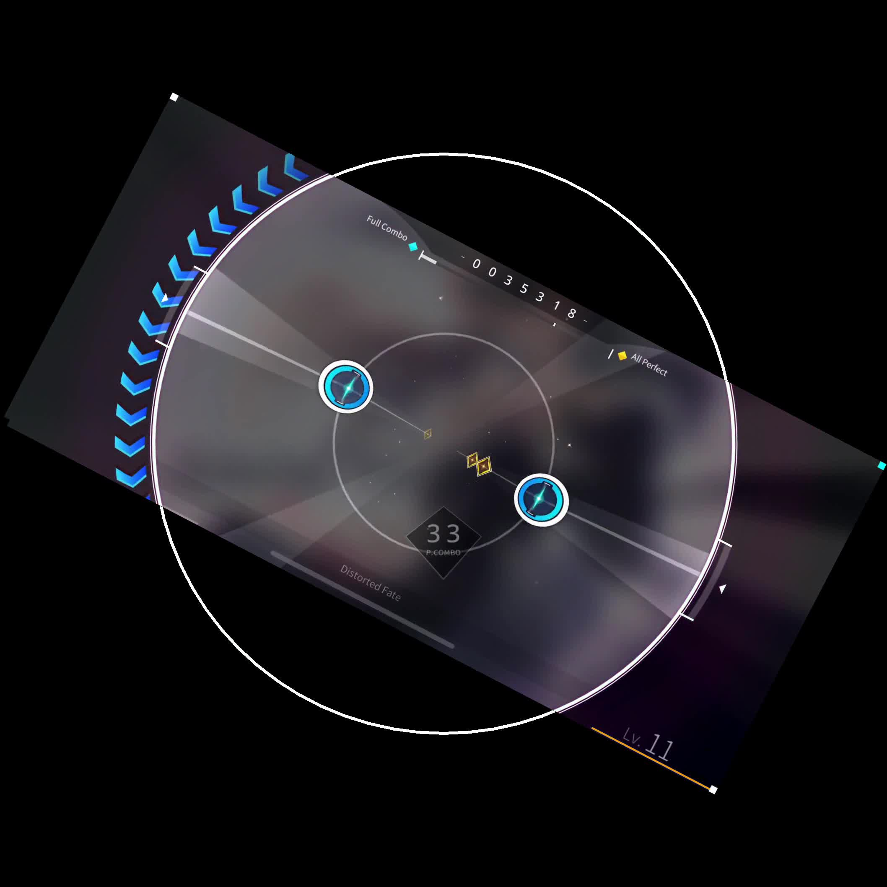

# Python Rotaeno Stabilizer (English README)

*阅读 [中文版](README.md).*



Check out
the [video demonstration](https://www.bilibili.com/video/BV1bc411f7fK/?share_source=copy_web&vd_source=9e94008dbf76e399a164028430118348)

This is a Python-based Rotaeno screen recording stabilization script. Its principle is the same as the script provided
by Rotaeno for Adobe After Effects, which rotates frames based on the colors of the four corners of the screen recording
in live broadcast mode. The goal is to stabilize the video image.

# Update Log

## v1.3
- Added background circle, optimized visual experience
- Fixed some bugs when the script runs on Windows
- Fixed the issue where the background circle could not be properly added to screen recordings with a small width-height ratio.
- Added support for mov, avi, mkv, wmv, flv formats

## v1.2

- Added multi-process optimization.

## v1.1

- Added square rendering feature (thanks to the PR by [@Ki-wimon](https://github.com/Ki-wimon)). The script now defaults
  to square rendering to minimize cropping of the frame.
- Added a `verbose=False` parameter to the `convert_vfr_to_cfr` and `add_audio_to_video` functions to reduce redundant
  command line output.
- Deleted intermediate files, keeping only the final output.

## v1.0

- Added the V2 correction method. The script now defaults to stabilizing videos using V2. If V1 correction is needed,
  please add "v1" at the beginning of the video filename. The script will automatically switch to V1 correction mode for
  stabilization, e.g., `v1-sample.mp4`.

## Features

- No need to install Adobe After Effects; rendering can be done with just one command.
- Supports batch processing of videos.

## Installation

1. Download the project code:

```shell
git clone https://github.com/Lawrenceeeeeeee/python_rotaeno_stabilizer.git
```

Alternatively, you can directly click "Download ZIP" on this repository page, then unzip the downloaded file.

2. Install the dependencies:

```shell
# Navigate to the directory containing the script
cd python_rotaeno_stabilizer
pip install -r requirements.txt
```

3. Install FFmpeg

Please download the appropriate installation package from
the [FFmpeg official website](https://ffmpeg.org/download.html).

## How to Use

0. **Attention!** Before recording, ensure the "Streaming Mode" is activated in Rotaeno settings. Once enabled, the four
   corners of the screen will display color blocks, which indicate the device's rotation angle.

1. Place the video to be processed in the videos directory (currently supports mp4, mov, avi, mkv, wmv, flv).

2. Start the project:

```shell
python main.py
```

3. Once processing is complete, find the rendered videos in the `output` folder.


Result as follows:


